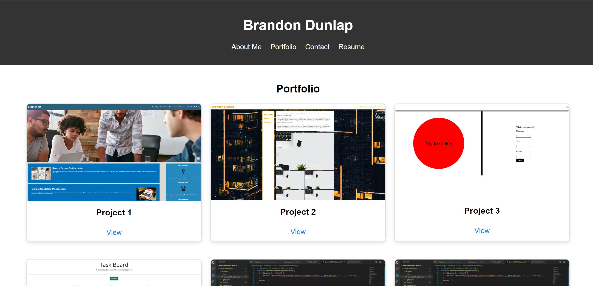

# React Portfolio

This is a portfolio website built using React. It showcases my projects and provides information about me, my skills, and how to contact me.

## Deployed Application

[Live Site](https://extraordinary-tarsier-9b11f6.netlify.app/)

## Screenshot




## Table of Contents

- [Description](#description)
- [Technologies Used](#technologies-used)
- [Installation](#installation)
- [Usage](#usage)
- [Features](#features)
- [Contributing](#contributing)
- [License](#license)
- [Contact](#contact)

## Description

This portfolio is designed to demonstrate my skills and projects as an aspiring Full-Stack Developer. It includes sections such as About Me, Portfolio, Contact, and Resume. The application is a single-page application (SPA) built with React and Vite, ensuring a fast and modern user experience.

## Technologies Used

- React
- React Router DOM
- Vite
- CSS

## Installation

To run this project locally, follow these steps:

1. **Clone the repository**:
   ```sh
   git clone https://github.com/BrandonDunlap/react-portfolio.git
2. **Naviage to the project directory**:
    ```sh
    cd react-portfolio
3. **Install the dependencies**:
    ```sh
    npm install
4. **Start the development server**:
    ```sh
    npm run dev

## Usage

Once the development server is running, you can view the application in your browser at http://localhost:3000.

## About Me
The About Me section provides a brief introduction about myself, including my background and current role.

## Portfolio
The Portfolio section showcases some of the projects I have worked on, with links to their deployed versions and corresponding GitHub repositories.

## Contact
The Contact section contains a form that allows visitors to send me a message directly.

## Resume
The Resume section includes a link to download my resume and a list of my proficiencies.

## Features

- Single-page application with React
- Responsive design for various devices
- Dynamic navigation with React Router DOM
- Contact form with validation
- Easy to update and maintain

## Contributing
If you would like to contribute to this project, please fork the repository and create a pull request with your changes. Ensure that your code follows the existing style and includes appropriate tests.

## License
This project is licensed under the MIT License.

## Contact
You can reach me at dunlapbrandon24@gmail.com

Connect with me on:

GitHub: https://github.com/BrandonDunlap
LinkedIn: https://www.linkedin.com/in/brandon-dunlap/